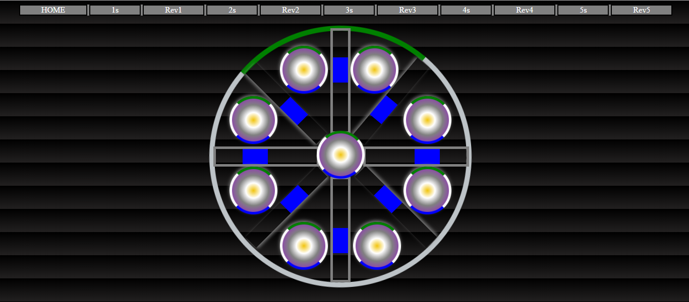
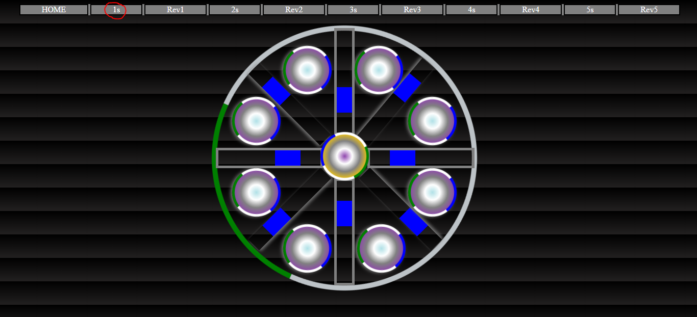
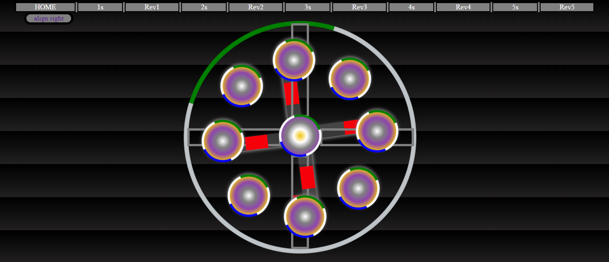

# CircleLoadProject

Hello! Geeky I am ajay UI/UX web enthusiast . I am very font of web development and I am slowly doing my best to improve 
best ever technology. This is a css animation related project.This project is designed with html and css. This project mainly
focused on how the css animation can be accessed by timing link. This project has many designed circles which will give animation
regarding the user click the link. Here css animations can be expressed.

### Test Link

## Screenshot

